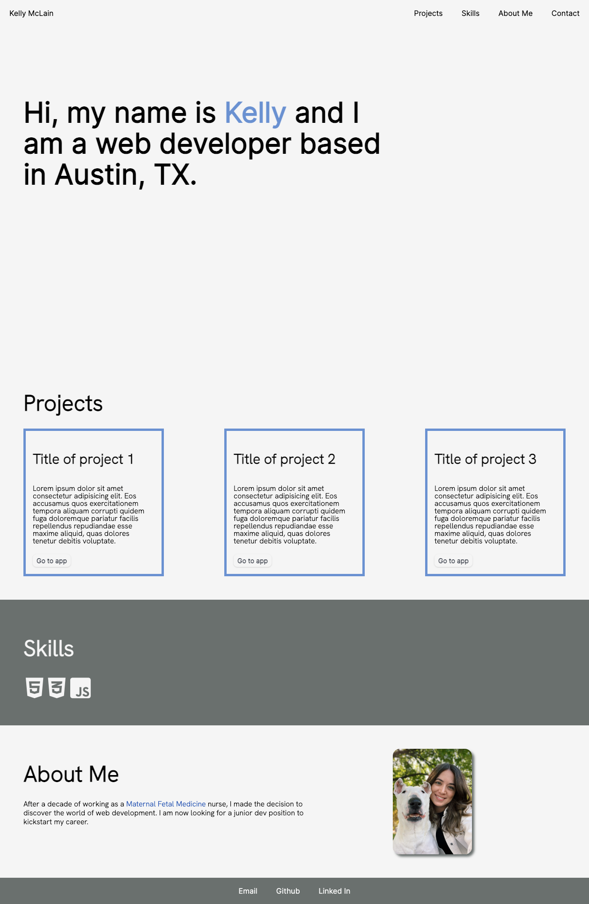

# Professional Portfolio- KellyMcLain

## Quick Links

[Click here](https://github.com/Rucatues/Professional-Portfolio-Kelly-McLain) to view final website

## Overview

A brief introduction to myself and my journey so far as a web developer. This page includes links at the top to scroll to the corresponding part of the page, contact links to Email, Linked In, and Github at the bottom, and features a section for recent projects to add periodically.

## Features

- Pseudo-classes for hovering over links and changing color of text

## Acknowledgements

Used reset sheet from UT Bootcamp activity 12-Stu_CSS-Resets

## Licence

MIT license
